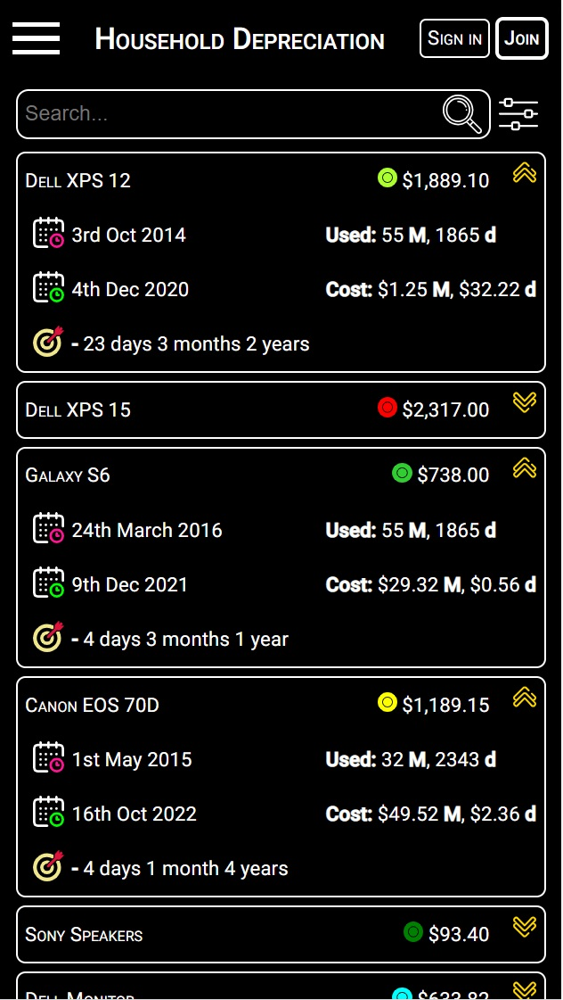
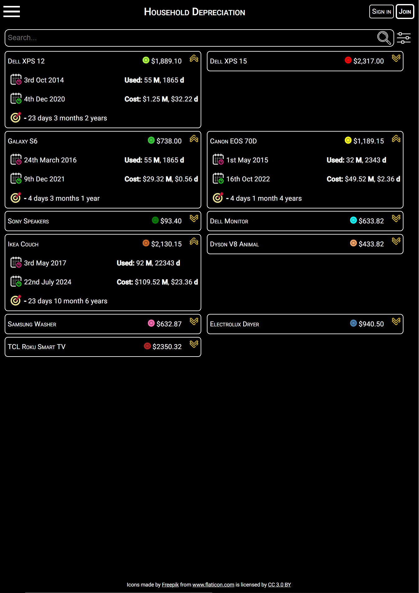
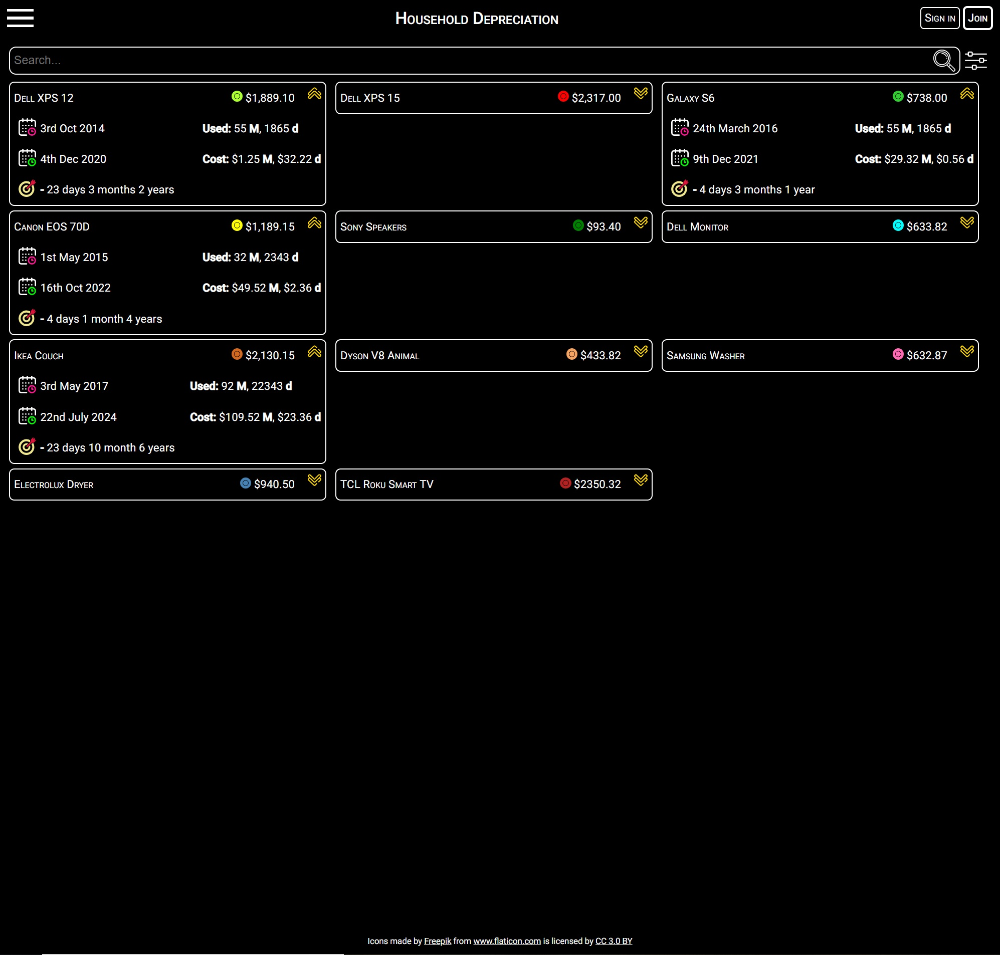

# Household Item Depreciation 

### Mission Statement
* I have had a serious problem with wanting too many things. Motorcycles, laptops, mobiles etc .....
* In an effort to be a bit more financially savy I decided to track the depreciation of household items I buy. That way I can get a better understanding of how much I'm spending on trivial things. 
* What better way to do it than to build my own system for it.

### Technologies Used

* Firebase database 
* CSS
  * Flexbox
  * Grid
* Fetch API
* OAuth 2.0 with Google APIs Client Library for JavaScript
* GitHub Projects and Milestones for agile development

### Project Phases

* Simple web app
* React app
* React Native client

### Repository Links

* [Layout Wireframe - Private Repository](https://github.com/kumudug/household_depreciation_layout_wireframe)
  * Mobile View

  * Tablet View

  * Desktop View

  

